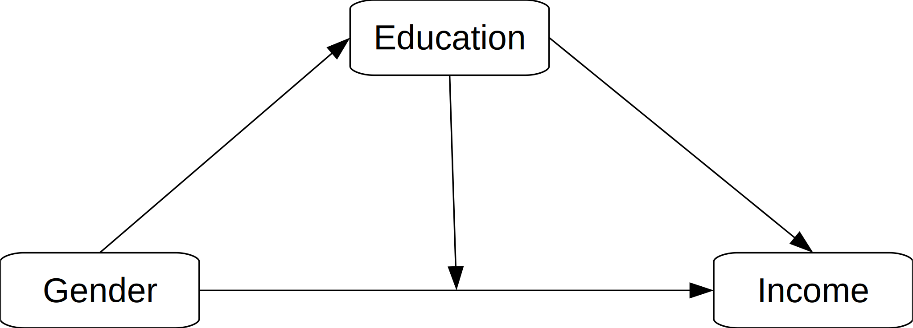
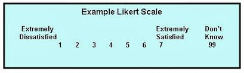

<!-- .slide: data-background="#acf2dc" data-transition="linear" -->

# SESSION 6:   DESCRIPTIVE INFERENCE&nbsp;1
## Data Analysis using Stata
Summer 2020 | MA Sociology | FU Berlin
    

---

## Learning Goals Session 6

- 6.1 Research Questions and Hypotheses
- 6.2 What is "Descriptive Inference"
- 6.3 Compare group means using t-test

---

## Learning Module 6.1: Research Questions

- In most cases, we are interested in the relationship between two or more variables.
- Basic question "What is the relationship between X and Y?"
- As we already know, there might be third variables involved. We are going to ignore these for now.

---

<!-- .slide: data-background="#F3E2A9" data-transition="linear" -->

### Conceptual Models

#### Simple effect

#### Moderation / Mediation

---

## Task:

- For your own analysis, please look through the Allbus variables and find a relationship that you want to analyze. 
- This entails both a dependent variable and one or more explanatory variables.

---

## Caution! Variable types

- With the methods we learn in this course, we can only analyze **continuous dependent variables**.
- However, you may analyze categorical variables on 7-point scales or above, as they can be argued to be quasi-continuous.

- Explanatory variables may be both categorial and dependent.

---

## Hypotheses

- After we have formulated a research question, we derive testable hypotheses.
- Usually, there are two contrasting hypotheses:
    - H0: "X and Y are not related" (null-hypothesis)
    - H1: "X has an influence on Y" (alternative hypothesis)

---

## Example:

- H0: Gender does not have an influence on Income.
- H1: Gender has an influence on income. (undirected hypothesis)

OR:

- H1: Being male increases income on average (directed hypothesis)

---

## Errors ($\alpha$ and $\beta$)

| Test \ Reality      | H0 is false      | H0 is true                    |
|---------------------|:----------------:|:-----------------------------:|
| **Reject H0**       | Correct Decision | *Type I error $\alpha$ error* |
| **Don't reject H0** | *Type II Error*  | Correct Decision              |

---

## Hypothesis testing

- To find out whether variables are related **in our sample**, we could compare means across groups. (e.g. mean income men vs. mean income women)
- BUT: An effect in our sample might be caused by chance.
- In order to test hypotheses **for our population**, we need statistical tests / inferential statistics.

